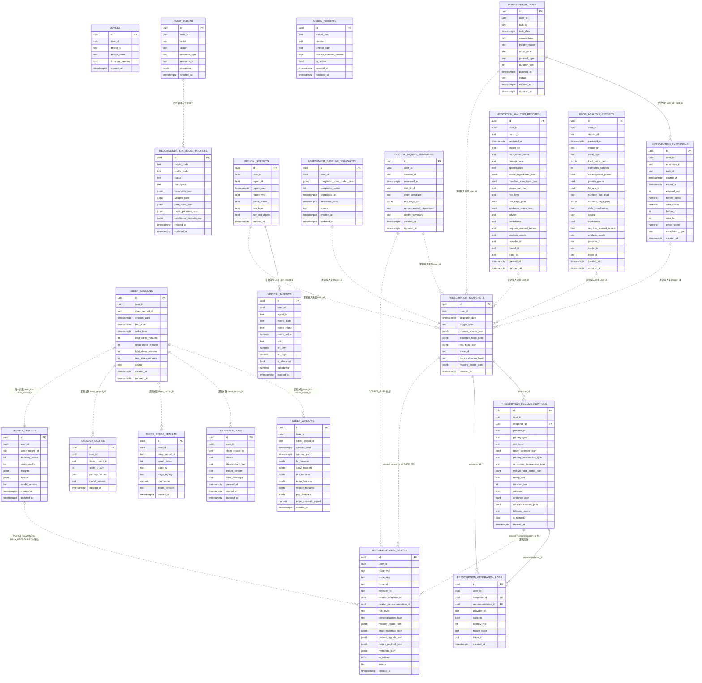

# 数据库 ER 图（本地与云端）

适用任务：项目开发文档、数据库设计说明、答辩材料  
阅读优先级：高  
是否允许直接对外引用：允许，建议配合字段说明一起使用

说明：

- 你上一句里写成了“两张本地数据库 ER 图”，这里按明显笔误处理为：
  - `本地数据库 ER 图`
  - `云端数据库 ER 图`
- 图中的关系只使用当前源码和 migration 中能确认的事实。
- 本地图里会额外标出“逻辑关联但无物理外键”的关系。
- 云端图优先展示 Supabase 中真正有业务价值的主表族，不把 RLS、索引和视图层展开进主图。

## 1. 本地数据库 ER 图（Android Room）

来源：

- [AppDatabase.kt](/D:/newstart/core-db/src/main/java/com/example/newstart/database/AppDatabase.kt)
- [entity](/D:/newstart/core-db/src/main/java/com/example/newstart/database/entity)

```mermaid
erDiagram
    SLEEP_RECORDS {
        string id PK
        long date
        long bedTime
        long wakeTime
        int totalSleepMinutes
        int deepSleepMinutes
        int lightSleepMinutes
        int remSleepMinutes
        int awakeMinutes
        float sleepEfficiency
        int fallAsleepMinutes
        int awakeCount
        long createdAt
        long updatedAt
    }

    HEALTH_METRICS {
        string id PK
        string sleepRecordId
        long timestamp
        int heartRateSample
        int bloodOxygenSample
        float temperatureSample
        int stepsSample
        float accMagnitudeSample
        int heartRateCurrent
        int bloodOxygenCurrent
        float temperatureCurrent
        int hrvCurrent
    }

    PPG_SAMPLES {
        string id PK
        string sleepRecordId
        long timestamp
        float ppgValue
    }

    RECOVERY_SCORES {
        string id PK
        string sleepRecordId FK
        long date
        int score
        float sleepEfficiencyScore
        float hrvRecoveryScore
        float deepSleepScore
        float temperatureRhythmScore
        float oxygenStabilityScore
        string level
        long createdAt
    }

    DEVICES {
        string deviceId PK
        string deviceName
        string macAddress
        int batteryLevel
        string firmwareVersion
        string connectionState
        long lastSyncTime
        bool isPrimary
        long createdAt
        long updatedAt
    }

    DOCTOR_SESSIONS {
        string id PK
        long createdAt
        long updatedAt
        string status
        string domain
        string chiefComplaint
        string riskLevel
    }

    DOCTOR_MESSAGES {
        string id PK
        string sessionId
        string role
        string messageType
        string content
        long timestamp
        string payloadJson
        string actionProtocolType
        int actionDurationSec
    }

    DOCTOR_ASSESSMENTS {
        string id PK
        string sessionId FK
        long createdAt
        string suspectedIssuesJson
        string symptomFactsJson
        string missingInfoJson
        string redFlagsJson
        string recommendedDepartment
        string doctorSummary
        string nextStepAdviceJson
        string disclaimer
    }

    ASSESSMENT_SESSIONS {
        string id PK
        string scaleCode
        long startedAt
        long completedAt
        int totalScore
        string severityLevel
        long freshnessUntil
        string source
    }

    ASSESSMENT_ANSWERS {
        string id PK
        string sessionId FK
        string itemCode
        int itemOrder
        int answerValue
    }

    MEDICAL_REPORTS {
        string id PK
        long reportDate
        string reportType
        string imageUri
        string ocrTextDigest
        string parseStatus
        string riskLevel
        long createdAt
    }

    MEDICAL_METRICS {
        string id PK
        string reportId FK
        string metricCode
        string metricName
        float metricValue
        string unit
        float refLow
        float refHigh
        bool isAbnormal
        float confidence
    }

    INTERVENTION_TASKS {
        string id PK
        long date
        string sourceType
        string triggerReason
        string bodyZone
        string protocolType
        int durationSec
        long plannedAt
        string status
        long createdAt
        long updatedAt
    }

    INTERVENTION_EXECUTIONS {
        string id PK
        string taskId FK
        long startedAt
        long endedAt
        int elapsedSec
        float beforeStress
        float afterStress
        int beforeHr
        int afterHr
        float effectScore
        string completionType
        string metadataJson
    }

    RELAX_SESSIONS {
        string id PK
        long startTime
        long endTime
        string protocolType
        int durationSec
        float preStress
        float postStress
        int preHr
        int postHr
        int preHrv
        int postHrv
        float preMotion
        float postMotion
        float effectScore
        string metadataJson
    }

    INTERVENTION_PROFILE_SNAPSHOTS {
        string id PK
        long generatedAt
        string triggerType
        string domainScoresJson
        string evidenceFactsJson
        string redFlagsJson
    }

    PRESCRIPTION_BUNDLES {
        string id PK
        long createdAt
        string triggerType
        string profileSnapshotId FK
        string primaryGoal
        string riskLevel
        string rationale
        string evidenceJson
        string status
    }

    PRESCRIPTION_ITEMS {
        string id PK
        string bundleId FK
        string itemType
        string protocolCode
        string assetRef
        int durationSec
        int sequenceOrder
        string timingSlot
        bool isRequired
        string status
    }

    MEDICATION_ANALYSIS_RECORDS {
        string id PK
        long capturedAt
        string imageUri
        string recognizedName
        string dosageForm
        string specification
        string activeIngredientsJson
        string matchedSymptomsJson
        string usageSummary
        string riskLevel
        string advice
        float confidence
        bool requiresManualReview
        string analysisMode
        string providerId
        string modelId
        string traceId
        string syncState
        string cloudRecordId
        long syncedAt
        long createdAt
        long updatedAt
    }

    FOOD_ANALYSIS_RECORDS {
        string id PK
        long capturedAt
        string imageUri
        string mealType
        string foodItemsJson
        int estimatedCalories
        float carbohydrateGrams
        float proteinGrams
        float fatGrams
        string nutritionRiskLevel
        string dailyContribution
        string advice
        float confidence
        bool requiresManualReview
        string analysisMode
        string providerId
        string modelId
        string traceId
        string syncState
        string cloudRecordId
        long syncedAt
        long createdAt
        long updatedAt
    }

    SLEEP_RECORDS ||--o{ RECOVERY_SCORES : "物理外键 sleepRecordId"
    SLEEP_RECORDS ||..o{ HEALTH_METRICS : "逻辑关联 sleepRecordId"
    SLEEP_RECORDS ||..o{ PPG_SAMPLES : "逻辑关联 sleepRecordId"

    DOCTOR_SESSIONS ||..o{ DOCTOR_MESSAGES : "逻辑关联 sessionId"
    DOCTOR_SESSIONS ||--o{ DOCTOR_ASSESSMENTS : "物理外键 sessionId"

    ASSESSMENT_SESSIONS ||--o{ ASSESSMENT_ANSWERS : "物理外键 sessionId"

    MEDICAL_REPORTS ||--o{ MEDICAL_METRICS : "物理外键 reportId"

    INTERVENTION_TASKS ||--o{ INTERVENTION_EXECUTIONS : "物理外键 taskId"

    INTERVENTION_PROFILE_SNAPSHOTS ||--o{ PRESCRIPTION_BUNDLES : "物理外键 profileSnapshotId"
    PRESCRIPTION_BUNDLES ||--o{ PRESCRIPTION_ITEMS : "物理外键 bundleId"
```

### 本地图解读

- `sleep_records` 是本地睡眠主表。
- `health_metrics`、`ppg_samples` 虽然都带 `sleepRecordId`，但当前 Room 没有声明物理外键，所以文档里应写成“逻辑关联”。
- 医生模块在本地是完整会话链：`doctor_sessions -> doctor_messages / doctor_assessments`。
- 量表模块是 `assessment_sessions -> assessment_answers`。
- 干预模块分为：
  - 计划层：`intervention_tasks`
  - 执行层：`intervention_executions`
  - 会话效果层：`relax_sessions`
- 画像与处方链是：
  - `intervention_profile_snapshots -> prescription_bundles -> prescription_items`
- 药物与饮食分析记录目前是独立表，主要通过业务层进入画像、恢复分和时间线，不依赖本地外键。

## 2. 云端数据库 ER 图（Supabase）

来源：

- [0001_core_schema.sql](/D:/newstart/cloud-next/supabase/migrations/0001_core_schema.sql)
- [0002_model_registry_and_audit_policies.sql](/D:/newstart/cloud-next/supabase/migrations/0002_model_registry_and_audit_policies.sql)
- [0004_intervention_and_medical_report.sql](/D:/newstart/cloud-next/supabase/migrations/0004_intervention_and_medical_report.sql)
- [0005_prescription_engine.sql](/D:/newstart/cloud-next/supabase/migrations/0005_prescription_engine.sql)
- [0006_personalization_support.sql](/D:/newstart/cloud-next/supabase/migrations/0006_personalization_support.sql)
- [0007_recommendation_tracking.sql](/D:/newstart/cloud-next/supabase/migrations/0007_recommendation_tracking.sql)
- [0008_recommendation_model_profiles.sql](/D:/newstart/cloud-next/supabase/migrations/0008_recommendation_model_profiles.sql)
- [0011_lifestyle_analysis_records.sql](/D:/newstart/cloud-next/supabase/migrations/0011_lifestyle_analysis_records.sql)
- [0013_prescription_personalization_meta.sql](/D:/newstart/cloud-next/supabase/migrations/0013_prescription_personalization_meta.sql)

### 云端图解读

- 云端核心主键几乎都围绕 `user_id` 做多租户隔离。
- 睡眠主链是：
  - `sleep_sessions`
  - `sleep_windows`
  - `inference_jobs`
  - `sleep_stage_results`
  - `anomaly_scores`
  - `nightly_reports`
- 医检主链是：
  - `medical_reports`
  - `medical_metrics`
- 干预主链是：
  - `intervention_tasks`
  - `intervention_executions`
- 画像与处方主链是：
  - `assessment_baseline_snapshots`
  - `doctor_inquiry_summaries`
  - `prescription_snapshots`
  - `prescription_recommendations`
  - `prescription_generation_logs`
- 药物/饮食分析主链是：
  - `medication_analysis_records`
  - `food_analysis_records`
- `recommendation_traces` 用于记录建议生成、周期总结、医生问诊等 AI 轨迹，但当前不是后台患者时间线的物理事件表。

## 3. 写文档时的使用建议

- 如果正文篇幅有限：
  - 本地数据库 ER 图放 Android 端存储小节。
  - 云端数据库 ER 图放云端架构或数据库设计小节。
- 如果要强调“端云协同”：
  - 可以把这两张图并排放，正文写“本地侧负责交互态和离线态数据组织，云端侧负责多用户、多任务和 AI 轨迹聚合”。
- 如果要强调“不是所有关系都有物理外键”：
  - 请在图注里明确写出“虚线关系表示业务逻辑关联，非数据库物理外键”。
