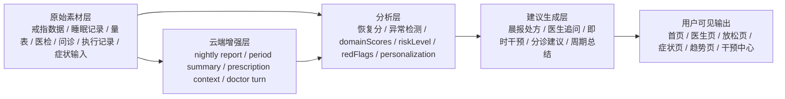

# 建议生成证据地图

## 1. 目的

这份文档用于回答一个实际工程问题：**项目里给用户展示的建议、处方、问诊结论、趋势解读和即时干预，到底是基于哪些素材生成的，原因链路是什么，落在哪些模块里。**

当前项目的建议生成不是单一模型直接“拍脑袋输出”，而是一个多源证据、分层分析、端云混合的系统。建议来源至少包含：

- 戒指端采集到的生理数据
- 睡眠记录与恢复分
- 量表与基线评估
- 医生问诊记录与结构化结论
- 医检报告 OCR 与指标异常
- 干预任务、执行结果、依从性
- 症状引导与用户主动选择
- 云端夜间报告、周期总结和 server-side evidence

## 2. 当前用户可见的建议类型

项目内当前真正会影响用户建议输出的主链可以分成 7 类：

1. 晨报建议与晨间处方
2. 个体化干预画像与每日处方
3. AI 医生问诊追问、风险分层与下一步建议
4. 放松中心即时干预建议
5. 症状引导页的分诊、检查建议与支持动作
6. 医检报告增强理解与风险提示
7. 趋势/周期报告中的总结、下一阶段重点与行动建议

除此之外，仓库里还存在旧版 `AdviceGenerator`、`EdgeLlmRagAdvisor` 等遗留链路，但它们已经不是当前主界面的主输出来源。

## 3. 总体链路

## 4. 原始素材层

### 4.1 戒指端与设备采集数据

主要入口：

- `app/src/main/java/com/example/newstart/bluetooth/BleManager.kt`
- `app/src/main/java/com/example/newstart/service/DataCollectionService.kt`
- `app/src/main/java/com/example/newstart/database/entity/HealthMetricsEntity.kt`
- `app/src/main/java/com/example/newstart/database/entity/PpgSampleEntity.kt`

当前已经进入建议链的设备素材包括：

- 心率：当前值、均值、最小值、最大值、趋势
- 血氧：当前值、均值、最低值、稳定性
- 体温：当前值、均值、状态
- HRV：当前值、基线、恢复率、趋势
- PPG 原始样本
- 动作强度：由加速度与陀螺仪融合得到
- 步数样本字段已预留，但当前主链使用不如前几项充分

这些数据既用于：

- 晨报恢复分与异常检测
- 医生页风险快照
- 症状引导页设备证据
- 趋势页时序图
- 干预画像中的 stress / recovery / fatigue 相关证据

### 4.2 睡眠记录

主要入口：

- `app/src/main/java/com/example/newstart/database/entity/SleepDataEntity.kt`
- `app/src/main/java/com/example/newstart/repository/SleepRepository.kt`

当前进入建议链的睡眠素材包括：

- 上床时间
- 起床时间
- 总睡眠时长
- 深睡、浅睡、REM 时长
- 清醒时长
- 睡眠效率
- 入睡时长
- 夜间觉醒次数

这些数据用于：

- 晨报恢复分
- 睡眠扰动评分
- 医生问诊上下文
- 趋势周报/月报
- 干预处方触发逻辑

### 4.3 量表与基线评估

主要入口：

- `app/src/main/java/com/example/newstart/ui/intervention/AssessmentBaselineViewModel.kt`
- `app/src/main/java/com/example/newstart/repository/AssessmentRepository.kt`
- `app/src/main/assets/assessment_catalog.json`

当前基线量表包括：

- `ISI`：失眠严重程度
- `ESS`：日间嗜睡
- `PSS10`：主观压力
- `GAD7`：焦虑
- `PHQ9`：抑郁
- `WHO5`：主观幸福感

这些量表当前不只是展示结果，还会直接进入：

- 干预画像 `domainScores`
- 红旗识别
- 每日处方
- 周期报告 personalization 与 confidence

其中 `PHQ9_9` 会进入红旗判断，是高风险链的一部分。

### 4.4 医生问诊记录

主要入口：

- `app/src/main/java/com/example/newstart/repository/DoctorConversationRepository.kt`
- `app/src/main/java/com/example/newstart/database/entity/DoctorSessionEntity.kt`
- `app/src/main/java/com/example/newstart/database/entity/DoctorMessageEntity.kt`
- `app/src/main/java/com/example/newstart/database/entity/DoctorAssessmentEntity.kt`

当前进入后续建议链的问诊素材包括：

- 主诉 `chiefComplaint`
- 全部历史消息
- 结构化症状事实 `symptomFacts`
- 缺失信息 `missingInfo`
- 疑似问题排序 `suspectedIssues`
- 红旗 `redFlags`
- 建议科室 `recommendedDepartment`
- 下一步建议 `nextStepAdvice`
- 医生总结 `doctorSummary`

这些信息会回流到：

- 干预画像
- 每日处方证据
- 周期报告 personalization
- 晨报中的缺失输入与可信度说明

### 4.5 医检报告与结构化指标

主要入口：

- `app/src/main/java/com/example/newstart/repository/MedicalReportRepository.kt`
- `app/src/main/java/com/example/newstart/database/entity/MedicalReportEntity.kt`
- `app/src/main/java/com/example/newstart/database/entity/MedicalMetricEntity.kt`

当前已进入主链的医检素材包括：

- OCR 识别得到的原始文本
- 解析出的指标名称、值、单位
- 参考范围
- 是否异常
- 置信度
- 报告级风险等级

这些会进入：

- 干预画像的 medical evidence
- 疲劳/恢复/压力等 domain 的补充证据
- 周期报告风险总结
- 晨报和医检页的提示文案

### 4.6 干预执行与依从性

主要入口：

- `intervention_tasks`
- `intervention_executions`
- `InterventionRepository`
- `PrescriptionRepository`

当前会进入建议链的执行素材包括：

- 最近任务数量
- 任务完成率
- 最近执行次数
- 平均效果分
- 干预前后压力差值
- 哪些 protocol 执行后效果更好
- 哪些 protocol 连续未完成

这些信息会直接影响：

- adherenceReadiness
- `breathingFatigue`
- preferred/downweighted protocol
- 每日处方 fallback 逻辑
- 周期报告中“下一阶段重点”

### 4.7 症状引导与用户主动输入

主要入口：

- `app/src/main/java/com/example/newstart/ui/relax/SymptomGuideViewModel.kt`

当前进入建议链的用户主动输入包括：

- 身体部位
- 正反面/左右侧
- 症状标签
- 严重度
- 持续时间
- 诱因
- 伴随症状
- 备注

这些与设备证据结合后生成：

- 风险等级
- 建议科室
- 建议检查
- 下一步动作
- 医生问诊预填文本
- 支持性干预动作

### 4.8 放松中心的人机交互信号

主要入口：

- `app/src/main/java/com/example/newstart/ui/relax/RelaxHubViewModel.kt`

当前进入即时干预建议的素材包括：

- 用户点击的身体热点部位
- 点击来源
- 即时压力指数 `stressIndex`
- 最新生命体征快照
- 今日放松执行摘要
- 本地 LLM 增强结果

这是一条经常被忽略的建议来源。它不是只看设备指标，还把用户点选的部位意图纳入了计划生成。

## 5. 分析中间层

### 5.1 晨报恢复分与异常检测

主要入口：

- `app/src/main/java/com/example/newstart/ui/home/MorningReportViewModel.kt`
- `app/src/main/java/com/example/newstart/service/ai/LocalAnomalyDetectionService.kt`

这里会把睡眠与设备数据加工成：

- 恢复分 `RecoveryScore`
- 风险等级与可信度
- 异常主因 `AnomalyPrimaryFactor`
- AI 可信度说明 `AiCredibilityState`

这是晨报建议的第一层原因解释。

### 5.2 干预画像 `domainScores`

主要入口：

- `app/src/main/java/com/example/newstart/repository/InterventionProfileRepository.kt`

当前核心域包括：

- `sleepDisturbance`
- `stressLoad`
- `fatigueLoad`
- `recoveryCapacity`
- `anxietyRisk`
- `depressiveRisk`
- `adherenceReadiness`

每个域不仅有分数，还有 `evidenceFacts`。这是当前全项目“建议为什么这样给”的最关键中间层。

当前画像会综合：

- 睡眠时长、睡眠效率、深睡比例
- 恢复分和 HRV 对比基线
- 量表结果
- 医生症状事实
- 医检异常项
- 干预执行历史

并生成：

- `domainScores`
- `evidenceFacts`
- `redFlags`
- personalization level
- missing inputs

### 5.3 风险等级与红旗

当前有多条链独立产出风险信息：

- 医生页 `DoctorDecisionEngine`
- 干预画像 `collectRedFlags`
- 症状引导页 `determineRiskLevel`
- 医检报告 `riskLevel`
- 晨报 `AiCredibilityState`
- 周期报告 `riskLevel`

这意味着项目里的“风险”不是单点字段，而是多场景、多粒度结果。

### 5.4 个体化程度

主要入口：

- `InterventionProfileRepository.buildPersonalizationStatus`
- `cloud-next/src/lib/personalization/status.ts`

当前 personalization 由三项关键输入决定：

- 最近设备数据是否充足
- 基线量表是否新鲜
- 结构化问诊是否新鲜

所以项目中一些建议之所以“保守”或“半个体化”，并不是模型能力不足，而是输入素材不完整。

## 6. 建议生成主链

### 6.1 晨报建议与晨间处方

主要入口：

- `app/src/main/java/com/example/newstart/ui/home/MorningReportViewModel.kt`

使用素材：

- 最新睡眠记录
- 最新健康指标
- 本地异常检测结果
- 最新干预画像
- 最新处方 bundle
- 前一日任务执行摘要

输出：

- `InterventionActionUiModel` 建议列表
- `AiCredibilityState`
- 晨间个体化摘要
- `interventionSummary`

### 6.2 每日处方

主要入口：

- `app/src/main/java/com/example/newstart/repository/PrescriptionRepository.kt`
- `cloud-next/src/lib/prescription/context.ts`

本地请求给 provider 的关键材料：

- `triggerType`
- `domainScores`
- `evidenceFacts`
- `redFlags`
- `personalizationLevel`
- `missingInputs`
- `ragContext`
- 协议目录 catalog

云端进一步补充的材料：

- 最近睡眠 session 数量
- 最新 nightly report
- 最近干预任务与执行
- 最新医检风险与异常指标
- 最新 baseline snapshot
- 最新 doctor inquiry summary

云端还会计算：

- `serverEvidenceFacts`
- `serverRedFlags`
- `breathingFatigue`
- `preferredProtocolCodes`
- `downweightedProtocolCodes`
- `averageEffectScore`
- `averageStressDrop`

最终输出：

- `primaryGoal`
- `riskLevel`
- `rationale`
- `evidence`
- 一组主/次/生活方式干预项

### 6.3 AI 医生问诊

主要入口：

- `app/src/main/java/com/example/newstart/ui/doctor/DoctorChatViewModel.kt`
- `app/src/main/java/com/example/newstart/ui/doctor/DoctorDecisionEngine.kt`
- `cloud-next/src/lib/ai/doctor-turn.ts`

素材来源：

- 用户当前消息
- 全量对话历史
- 设备快照：恢复分、睡眠时长、睡眠效率、觉醒次数、心率、最低血氧、HRV 当前值/基线
- 本地 RAG 上下文
- 历史主诉
- 当前 stage 与 follow-up count

输出：

- 继续追问问题
- 结构化问诊结论
- 风险等级
- 建议科室
- 下一步建议
- 医生总结
- 推荐干预动作

### 6.4 放松中心即时干预

主要入口：

- `app/src/main/java/com/example/newstart/ui/relax/RelaxHubViewModel.kt`

素材来源：

- 用户点击部位
- 即时 stressIndex
- 最新 HR/HRV/SpO2 等体征
- 今日执行摘要
- 本地 LLM 增强结果

输出：

- 计划标题
- 计划原因
- 规则
- protocolType
- duration
- 是否 AI enhanced

### 6.5 症状引导页

主要入口：

- `app/src/main/java/com/example/newstart/ui/relax/SymptomGuideViewModel.kt`

素材来源：

- 身体部位与症状标签
- 严重度
- 持续时间
- 诱因
- 伴随症状
- 备注
- 最新设备证据

输出：

- 风险标题与风险摘要
- 疑似方向
- 证据摘要
- 建议科室
- 建议检查
- 下一步建议
- 医生问诊预填文本
- 支持动作

### 6.6 医检报告增强

主要入口：

- `MedicalReportRepository.parseAndStore`
- `MedicalReportAiService`

素材来源：

- OCR 纯文本
- 结构化草稿
- 解析出的指标

输出：

- abnormalCount
- report riskLevel
- 指标列表
- 用于后续画像/周报的 medical evidence

### 6.7 趋势/周期报告

主要入口：

- `app/src/main/java/com/example/newstart/ui/trend/SleepTrendViewModel.kt`
- `cloud-next/src/lib/report/period-summary.ts`

素材来源：

- 最近一段时间的睡眠历史
- 恢复历史
- 健康指标时间序列
- PPG 样本
- 干预任务与执行
- 最新医检风险与异常项
- 最新干预画像
- personalization 状态

输出：

- `headline`
- `riskSummary`
- `highlights`
- `metricChanges`
- `interventionSummary`
- `nextFocusTitle`
- `nextFocusDetail`
- `actions`
- `reportConfidence`

## 7. 当前主链与遗留链的边界

### 7.1 当前主链

当前主界面真正依赖的建议主链是：

- `MorningReportViewModel`
- `InterventionProfileRepository`
- `PrescriptionRepository`
- `DoctorChatViewModel`
- `RelaxHubViewModel`
- `SymptomGuideViewModel`
- `MedicalReportRepository / MedicalReportAiService`
- `SleepTrendViewModel`
- `cloud-next` 中 `prescription context / doctor-turn / period-summary`

### 7.2 遗留或次级链路

仓库中还存在这些旧逻辑：

- `app/src/main/java/com/example/newstart/data/ActionAdvice.kt`
- `app/src/main/java/com/example/newstart/ai/EdgeLlmRagAdvisor.kt`

这些逻辑仍有参考价值，但不应被误判为当前主产品建议引擎。

## 8. 素材矩阵

| 素材 | 主要来源 | 进入的分析层 | 最终影响的建议 |
|---|---|---|---|
| 心率、血氧、体温、HRV、PPG、动作强度 | BLE / DataCollectionService | 恢复分、异常检测、stress/recovery evidence | 晨报、医生页、趋势、放松建议、症状页 |
| 睡眠记录 | SleepDataEntity | 睡眠扰动、恢复、周期变化 | 晨报、处方、医生页、趋势 |
| 量表结果 | assessment catalog / AssessmentRepository | anxiety/depression/stress/fatigue evidence | 处方、画像、周报、风险提示 |
| 医生对话与结构化问诊 | DoctorConversationRepository | symptom facts、missing info、red flags | 医生建议、画像、处方、周报 |
| 医检 OCR 与异常指标 | MedicalReportRepository | medical evidence、riskLevel | 画像、周报、医检页、晨报提示 |
| 干预任务与执行效果 | InterventionRepository | adherenceReadiness、preferred/downweighted protocols | 每日处方、趋势报告、即时建议 |
| 症状引导输入 | SymptomGuideViewModel | 分诊风险、疑似方向 | 科室建议、检查建议、支持动作 |
| 热点点击与即时状态 | RelaxHubViewModel | stressIndex、即时 plan | 放松中心即时建议 |
| 云端 nightly report | cloud prescription context | serverEvidenceFacts、recovery evidence | 云端处方 |
| personalization 缺失项 | profile/local + cloud status | preview/full | 晨报可信度、周报 confidence、处方保守程度 |

## 9. 当前缺口

当前素材已经不少，但还有几个明显缺口：

1. 建议原因散落在多个 ViewModel 和 Repository 中，缺少统一可追踪解释层。
2. 风险等级有多条链分别计算，尚未统一成一个跨页面的“风险解释协议”。
3. 设备侧已采到的部分原始信号仍未被充分利用，例如步数与更细粒度活动特征。
4. 旧版 advice 逻辑仍存在，后续容易和当前主链混淆。
5. 目前“建议为什么这样给”的展示仍然偏分散，虽然证据存在，但没有统一解释面板。

## 10. 维护建议

后续如果要继续增强“建议生成的可解释性”，优先级应当是：

1. 为所有用户建议统一补一层 `evidence -> reasoning -> output` 协议。
2. 把 `domainScores / evidenceFacts / redFlags / personalization` 作为统一解释核心。
3. 明确标记 legacy advice 逻辑，避免继续混入新页面。
4. 在 UI 上逐步统一“建议原因”展示口径，而不是每页自己拼一句说明。

---

如果后续还要继续扩充，本文件应优先更新以下位置的变化：

- `InterventionProfileRepository`
- `PrescriptionRepository`
- `DoctorChatViewModel`
- `RelaxHubViewModel`
- `SymptomGuideViewModel`
- `MedicalReportRepository`
- `SleepTrendViewModel`
- `cloud-next/src/lib/prescription/context.ts`
- `cloud-next/src/lib/ai/doctor-turn.ts`
- `cloud-next/src/lib/report/period-summary.ts`
