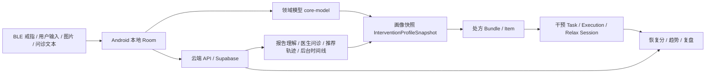

# 5.x 章节所需关键材料汇总

更新时间：2026-03-21

适用范围：为《项目开发文档》5.1-5.12 提供可直接取材的资料索引、事实摘要、源码证据与截图资产。

使用建议：
- 先引用“现成文档”作为主材料。
- 再用“源码证据”补足 5.5、5.7、5.8、5.9/5.10/5.12 的实现细节。
- 5.5 必须明确区分“4.4 原型图”和“真实运行界面”，不要混写。

## A. 5.1 / 5.4 最关键的资料

### 现成材料

- `docs/30_AI写作与投喂/长庚环_AI投喂资料包/02_系统事实/04_关键时序链路.md`
- `docs/30_AI写作与投喂/长庚环_AI投喂资料包/02_系统事实/03_数据对象与存储层说明.md`
- `docs/30_AI写作与投喂/长庚环_AI投喂资料包/02_系统事实/06_设备_蓝牙_采集_落库事实表.md`
- `docs/40_源码全景底稿/项目开发源码全景底稿/03_附录C_数据对象与端云状态流.md`
- `docs/30_AI写作与投喂/长庚环_AI投喂资料包/02_系统事实/05_AI能力与模型供应矩阵.md`

### 可直接写入 5.1 的关键时序链路

1. 戒指连接到落库
   `feature-device` 发起扫描与连接，`core-ble` 解析 BLE 数据帧，健康指标与 PPG 写入 Room，本地数据随后被今日页、干预页、趋势页与恢复分消费。

2. 报告上传到可读结果
   Android 先做文件导入、OCR 文本整理与本地解析；云端 `/api/report/understand` 做结构化理解与可读报告生成；失败时本地仍可用 OCR markdown + 格式化逻辑输出降级版可读报告。

3. 问诊到结构化结果
   Android 组织对话上下文并调用 `/api/doctor/turn`；云端优先输出 follow-up 或 assessment；若云端不可用或未登录，则本地 `DoctorInferenceEngine` 仍会产出结构化问诊结果。

4. 干预执行到反馈回写
   干预中心生成任务，执行过程中记录时长、压力变化、心率变化、metadata，完成后写入 `relax_sessions` 与 `intervention_executions`，再进入趋势、复盘与恢复分。

### 可直接写入 5.4 的数据流说明

| 数据类型 | 本地 | 云端 | 回退/兜底 |
| --- | --- | --- | --- |
| BLE 戒指实时指标 | 是，Room 主落点 | 条件上传 | 断流时页面降级展示已有本地数据 |
| 睡眠记录与恢复分 | 是，本地主事实源 | 是，趋势聚合与历史同步 | 本地优先，云端增强 |
| 医检报告 OCR 与指标 | 是，本地保存报告、OCR 摘要、指标、风险 | 是，结构化理解与可读报告 | 云端失败时本地格式化可读版 |
| 医生问诊记录 | 是，会话、消息、assessment 落本地 | 是，`doctor/turn` 与 inquiry summary | 云端失败时本地规则问诊引擎 |
| 药物/饮食识别记录 | 是，本地表含 `provider/model/trace/syncState` | 是，图像分析与记录 upsert | 未登录时可手动补录并仅本地保存 |
| 干预任务/执行/metadata | 是，本地任务、执行、会话、画像快照 | 是，task/execution/effect-trend | 本地先执行，云端再追踪 |
| 机器人文案与 TTS | 入口、缓存、播放在本地 | 文案与 TTS 主链在云端 | 文案可回退本地 Spark/脚本，语音可回退缓存或无音频文本模式 |

### 源码证据

- `core-data/src/main/java/com/example/newstart/service/ai/MedicalReportAiService.kt`
- `core-data/src/main/java/com/example/newstart/repository/MedicalReportRepository.kt`
- `feature-doctor/src/main/java/com/example/newstart/service/ai/DoctorAiService.kt`
- `feature-doctor/src/main/java/com/example/newstart/ui/doctor/DoctorInferenceEngine.kt`
- `app-shell/src/main/java/com/example/newstart/ui/avatar/DesktopAvatarNarrationService.kt`
- `core-network/src/main/java/com/example/newstart/network/ApiService.kt`

## B. 5.2 / 5.3 / 5.11 最关键的资料

### 现成材料

- `docs/30_AI写作与投喂/长庚环_AI投喂资料包/02_系统事实/01_Android架构与模块地图.md`
- `docs/30_AI写作与投喂/长庚环_AI投喂资料包/02_系统事实/02_Cloud与后台系统全景.md`
- `docs/30_AI写作与投喂/长庚环_AI投喂资料包/01_项目全景/03_功能全景图_页面地图.md`
- `docs/30_AI写作与投喂/长庚环_AI投喂资料包/02_系统事实/08_项目演进与历史归档说明.md`
- `docs/40_源码全景底稿/项目开发源码全景底稿/06_附录F_legacy_app与现行模块映射.md`

### Android 架构与模块地图

- 当前 Android 唯一运行入口是 `:app-shell`。
- 现行模块为 `app-shell + core-* + feature-*`。
- `core-common` 负责导航、主题、共享 UI。
- `core-model` 负责领域模型。
- `core-db` 负责 Room。
- `core-data` 负责 Repository 与业务编排。
- `core-ble` 负责 BLE。
- `core-network` 负责 Retrofit/OkHttp、认证会话与云接口。
- `core-ml` 负责本地模型和本地兜底能力。
- `feature-home/device/doctor/relax/trend/profile` 承接业务页面。

### Cloud 与后台系统全景

- `cloud-next` 同时承担 Android API、认证页面、后台页面、AI 编排、模型/作业/审计能力。
- 后台主页面为：
  - `/dashboard`
  - `/patients`
  - `/recommendations`
  - `/reports`
  - `/system`
- 后台与业务逻辑核心落点在：
  - `cloud-next/src/lib/admin-dashboard.ts`
  - `cloud-next/src/lib/admin-patients.ts`
  - `cloud-next/src/lib/admin-recommendations.ts`
  - `cloud-next/src/lib/admin-reports.ts`
  - `cloud-next/src/lib/admin-system.ts`

### 功能全景图 / 页面地图

- 一级导航：今日、医生、趋势、设备、我的。
- 关键二级链路：症状自查、医检报告分析、干预中心、呼吸训练、Zen 轻交互、音景干预、药物分析、饮食分析、桌面机器人。
- 推荐写法：把页面写成“业务闭环中的站点”，而不是“菜单列表”。

### contracts / bootstrap / demo seed 补强材料

- 共享契约：
  - `contracts/README.md`
  - `contracts/schemas/common-envelope.schema.json`
  - `contracts/typescript/index.ts`
  - `contracts/kotlin/src/main/kotlin/com/example/newstart/contracts/InterventionDtos.kt`
- 统一 envelope 约定：`{ code, message, data, traceId }`
- demo seed：
  - `docs/80_演示与答辩/长庚环_演示账号与闭环观演手册.md`
  - `cloud-next/scripts/demo-accounts/seed.mjs`
- demo bootstrap：
  - `cloud-next/src/app/api/demo/bootstrap/route.ts`
  - `core-data/src/main/java/com/example/newstart/repository/DemoBootstrapCoordinator.kt`

### current / legacy 区分说明

- `settings.gradle.kts` 只包含 `:app-shell` 和各 `core-*` / `feature-*` 模块，不再包含 `:app`。
- `app/` 是历史归档与映射参考，不是当前 APK 运行入口。
- 很多页面仍保留 `com.example.newstart.ui.*` 旧包名，但物理文件已迁入新模块，这是“物理模块化、包名历史延续”的状态。

## C. 5.5 用户界面设计最关键的资料

### 1. 原型图素材

原型图总目录：

- `docs/50_图示与附图/image/项目开发文档原型图/`

原型图清单：

- `图4-1_今日状态模块原型图.png`
- `图4-2_设备接入与采集模块原型图.png`
- `图4-3_医生问诊模块原型图.png`
- `图4-4_医检报告理解模块原型图.png`
- `图4-5_干预中心模块原型图.png`
- `图4-6_干预执行模块原型图.png`
- `图4-7_趋势复盘模块原型图.png`
- `图4-8_药物分析模块原型图.png`
- `图4-9_饮食分析模块原型图.png`
- `图4-10_机器人讲解与语音播报模块原型图.png`
- `图4-11_账号与个人中心模块原型图.png`
- `图4-12_系统主导航总览原型图.png`
- `图4-13_后台总览与患者工作台原型图.png`
- `图4-14_报告推荐系统管理后台原型图.png`

### 2. Android 真实运行界面截图

优先使用这批命名清晰、时间较新的截图：

- `current-screen.png`
- `doctor_real.png`
- `breathing-screen.png`
- `breathing-screen-2.png`
- `session-screen.png`
- `zen-screen.png`
- `zen_running_confirm.png`
- `zen_running_with_audio.png`
- `captures/app-home-final.png`
- `captures/relax_center_entry.png`
- `captures/profile_check_profile.png`

### 3. 后台真实运行截图

优先使用这批 Playwright 导出的后台截图：

- `cloud-next/output/playwright/login-cn.png`
- `cloud-next/output/playwright/admin-patients-3067217117.png`
- `cloud-next/output/playwright/admin-patient-interventions-cn.png`
- `cloud-next/output/playwright/admin-models-cn.png`

### 4. 5.5 的写法建议

- 4.4 使用原型图说明“设计意图、交互布局、功能规划”。
- 5.5 使用真实运行界面说明“最终视觉呈现、已落地交互、真实后台工作台”。
- 每张图都应显式标注：
  - `原型图`
  - `Android 实际运行界面`
  - `后台实际运行界面`
- 不要把原型图混写成“当前已运行界面”。

### 5. 仍建议补拍的界面

- 后台 `reports` 页面真实截图
- 后台单患者 `timeline/medical` 详情截图
- Android 医检报告结果页真实截图
- Android 趋势周报 / 月报真实截图

## D. 5.6 数据结构设计最关键的资料

### 现成材料

- `docs/30_AI写作与投喂/长庚环_AI投喂资料包/02_系统事实/03_数据对象与存储层说明.md`
- `docs/40_源码全景底稿/项目开发源码全景底稿/03_附录C_数据对象与端云状态流.md`

### 本地核心数据对象

- 睡眠与生理：
  - `SleepDataEntity`
  - `HealthMetricsEntity`
  - `PpgSampleEntity`
  - `RecoveryScoreEntity`
  - `DeviceEntity`
- 医生问诊与量表：
  - `DoctorSessionEntity`
  - `DoctorMessageEntity`
  - `DoctorAssessmentEntity`
  - `AssessmentSessionEntity`
  - `AssessmentAnswerEntity`
- 医检报告：
  - `MedicalReportEntity`
  - `MedicalMetricEntity`
- 干预与处方：
  - `RelaxSessionEntity`
  - `InterventionTaskEntity`
  - `InterventionExecutionEntity`
  - `InterventionProfileSnapshotEntity`
  - `PrescriptionBundleEntity`
  - `PrescriptionItemEntity`
- 生活方式：
  - `MedicationAnalysisEntity`
  - `FoodAnalysisEntity`

### 云端关键业务对象

- sleep sessions / nightly reports
- recovery / trend / period summary
- medical reports / medical metrics
- doctor inquiry summaries
- intervention tasks / executions
- recommendation traces / effect tracking
- model registry / inference jobs
- medication analysis records
- food analysis records
- assessment baseline snapshots
- audit events

### 共享数据对象

- `contracts/schemas/common-envelope.schema.json`
- `contracts/schemas/intervention-task.schema.json`
- `contracts/schemas/intervention-execution.schema.json`
- `contracts/schemas/intervention-effect.schema.json`
- `contracts/typescript/index.ts`
- `contracts/kotlin/src/main/kotlin/com/example/newstart/contracts/InterventionDtos.kt`

### 可直接放进 5.6 的概念图

## E. 5.7 接口设计最关键的资料

### 现成材料

- `docs/30_AI写作与投喂/长庚环_AI填充用_云端API与路由索引.md`
- `core-network/src/main/java/com/example/newstart/network/ApiService.kt`
- `cloud-next/src/app/api/`

### 外部服务清单

| 类别 | 当前落点 | 说明 |
| --- | --- | --- |
| BLE | `feature-device` + `core-ble` | 戒指扫描、连接、帧解析、采集 |
| 登录/认证 | `cloud-next/api/auth/*` + Supabase | 注册、登录、刷新、确认邮件、重置密码 |
| 报告理解 | `/api/report/understand` | 云端结构化理解与可读报告 |
| 问诊 | `/api/doctor/turn` | 云端结构化问诊增强 |
| 图像分析 | `/api/medication/analyze`、`/api/food/analyze` | 药物/饮食图像理解 |
| TTS | `/api/ai/speech/synthesize` | 云端豆包主链，vector_engine 回退 |
| 语音转写 | `/api/ai/speech/transcribe` | 医生页和语音输入能力 |
| OCR/语音/数字人配置 | `local.properties` + `BuildConfig` + 讯飞配置 | 属于 Android 侧集成能力，不是云端主链 |

### Android 内部接口 / 模块调用关系

- `app-shell` 作为壳层容器，承接导航、桌面机器人、后台服务与全局生命周期。
- `feature-*` 页面通过 `core-data` 获取业务数据。
- `core-data` 同时连接：
  - `core-db`
  - `core-network`
  - `core-ml`
- `core-network/ApiService.kt` 是 Android 到云端的核心 Retrofit 接口层。

### 后台与业务逻辑接口

- 页面层：
  - `cloud-next/src/app/dashboard`
  - `cloud-next/src/app/patients`
  - `cloud-next/src/app/recommendations`
  - `cloud-next/src/app/reports`
  - `cloud-next/src/app/system`
- 业务聚合层：
  - `cloud-next/src/lib/admin-dashboard.ts`
  - `cloud-next/src/lib/admin-patients.ts`
  - `cloud-next/src/lib/admin-recommendations.ts`
  - `cloud-next/src/lib/admin-reports.ts`
  - `cloud-next/src/lib/admin-system.ts`

### 关键 Restful 路由列表

- 认证与资料：
  - `POST /api/auth/register`
  - `POST /api/auth/login`
  - `POST /api/auth/refresh`
  - `POST /api/auth/resend-confirmation`
  - `POST /api/auth/password-reset`
  - `GET /api/user/profile`
  - `PUT /api/user/profile`
- 睡眠与恢复：
  - `POST /api/sleep/upload`
  - `POST /api/sleep/analyze`
  - `GET /api/sleep/history`
  - `GET /api/recovery/trend`
  - `POST /api/sync`
  - `POST /api/data/upload`
- 报告与问诊：
  - `POST /api/report/understand`
  - `POST /api/report/metrics/upsert`
  - `GET /api/report/latest`
  - `GET /api/report/period-summary`
  - `POST /api/doctor/turn`
  - `POST /api/doctor/inquiry-summary/upsert`
- 干预与评估：
  - `POST /api/advice/generate`
  - `POST /api/intervention/task/upsert`
  - `POST /api/intervention/execution/upsert`
  - `GET /api/intervention/effect/trend`
  - `POST /api/assessment/baseline-summary/upsert`
- 多模态：
  - `POST /api/avatar/narration`
  - `POST /api/ai/speech/transcribe`
  - `POST /api/ai/speech/synthesize`
  - `POST /api/medication/analyze`
  - `POST /api/food/analyze`
  - `POST /api/medication/records/upsert`
  - `POST /api/food/records/upsert`

## F. 5.8 错误 / 异常处理设计最关键的资料

### 可直接写入的典型错误场景

| 场景 | 当前处理方式 | 证据 |
| --- | --- | --- |
| 认证过期 / 401 | `ApiClient` 触发 refresh，失败则清会话并要求重新登录 | `core-network/.../ApiClient.kt` |
| 注册时网络瞬断 | `CloudAccountRepository` 对瞬时网络错误重试一次 | `core-data/.../CloudAccountRepository.kt` |
| 报告理解云端失败 | 本地仍保留 OCR、指标解析和降级可读报告 | `MedicalReportAiService.kt` |
| 问诊云端失败或未登录 | 本地 `DoctorInferenceEngine` 规则引擎直接产出 follow-up / assessment | `DoctorAiService.kt` + `DoctorInferenceEngine.kt` |
| 机器人文案云端失败 | 回退本地 Spark，再不行回退本地脚本 | `DesktopAvatarNarrationService.kt` |
| TTS 失败 | 先尝试缓存，缓存没有则退化为纯文本气泡 | `DesktopAvatarNarrationService.kt` + `cloud-next/src/lib/ai/multimodal.ts` |
| 药物/饮食未登录 | 不做云端识别，允许手动补录并本地保存 | `docs/30_AI写作与投喂/长庚环_AI投喂资料包/02_系统事实/05_AI能力与模型供应矩阵.md` |
| 演示账号元信息缺失 | bootstrap 失败并停止导入 | `DemoBootstrapCoordinator.kt` |
| 睡眠模型不可用 | worker fallback 生成可展示结果 | `docs/10_项目事实与架构/长庚环_睡眠分期模型说明.md` |

### 当前已有的 retry / fallback / 本地兜底

- 网络层：
  - OkHttp `retryOnConnectionFailure(true)`
  - 认证刷新最多重试 2 次
- 认证层：
  - 注册遇到瞬时网络问题延迟 800ms 后再试一次
- 报告链：
  - 本地 parser + formatter 兜底
- 问诊链：
  - 本地规则问诊引擎兜底
- 机器人链：
  - 云端 narration
  - 本地 Spark
  - 本地脚本 fallback
  - 本地音频缓存
- 图像分析链：
  - 自动识别依赖登录云端
  - 未登录场景手动补录 + 本地保存
- 睡眠分析链：
  - 云端 HTTP 模型
  - `local://baseline`
  - `local://ensemble`
  - worker fallback

### 演示链异常处理

- 演示账号登录后，`/api/demo/bootstrap` 下发快照。
- Android 侧 `DemoBootstrapCoordinator` 会：
  - 校验 `demoRole/demoScenario/demoSeedVersion`
  - 清空旧表
  - 导入 snapshot
  - 记录当前导入版本
- 如果不是 demo 账号或当前无会话，会清理 demo 状态并退出演示模式。

## G. 5.9 / 5.10 / 5.12 最关键的资料

### 现成材料

- `docs/30_AI写作与投喂/长庚环_AI填充用_配置与环境事实表.md`
- `docs/80_演示与答辩/长庚环_演示账号与闭环观演手册.md`
- `docs/30_AI写作与投喂/长庚环_AI投喂资料包/02_系统事实/05_AI能力与模型供应矩阵.md`
- `docs/20_专题系统说明/RECOMMENDATION_EVIDENCE_MAP.md`
- `docs/20_专题系统说明/SCIENTIFIC_RECOMMENDATION_MODEL.md`
- `docs/20_专题系统说明/SRM_V2_CONFIGURATION_PLAN.md`
- `docs/20_专题系统说明/DESKTOP_AVATAR_SYSTEM_INSTRUCTION.md`
- `docs/10_项目事实与架构/长庚环_睡眠分期模型说明.md`

### 配置策略

配置分三层：

1. Android 构建层
   - `gradle.properties`
   - `app-shell/build.gradle.kts`
   - `local.properties`
   - 通过 `BuildConfig` 注入 `API_BASE_URL`、讯飞配置、模型接入参数

2. 云端部署层
   - Vercel 环境变量
   - 典型值：`APP_PUBLIC_BASE_URL`、Supabase key、内部 worker token、AI provider key

3. 第三方控制面
   - Supabase Dashboard：Site URL、Redirect URLs、Custom SMTP、Auth 行为
   - Cloudflare：DNS
   - Resend：SMTP 发信基础设施

### provider / 模型配置

- 文本结构化主链：
  - `openrouter / google/gemini-2.5-flash`
  - `vector_engine / gpt-4.1-mini`
  - `deepseek / deepseek-v3.2`
- 图像分析主链：
  - `vector_engine / qwen3-vl-235b-a22b-instruct`
- TTS 主链：
  - `doubao / seed-tts-2.0-standard`
  - 失败时保留 `vector_engine` 音频 fallback
- 睡眠模型：
  - 训练与研究在 `ml/`
  - 云端 model registry 与 fallback 逻辑在 `cloud-next`
  - Android 端是异常检测 TFLite，而不是完整五阶段分期

### 环境变量 / 功能开关

- Android API 域名：
  - `DEBUG_API_BASE_URL`
  - `RELEASE_API_BASE_URL`
- 当前统一域名：
  - `https://cloud.changgengring.cyou`
- demo 相关：
  - `DEMO_ACCOUNT_DEFAULT_PASSWORD`
  - `DEMO_ADMIN_DEFAULT_PASSWORD`
  - `DEMO_ACCOUNT_EMAIL_DOMAIN`
  - `ADMIN_EMAIL_ALLOWLIST`
- recommendation 配置：
  - 见 `docs/20_专题系统说明/SRM_V2_CONFIGURATION_PLAN.md`
  - 运行时还涉及 `cloud-next/src/lib/model-registry.ts`

### 演示账号配置 / demo seed / bootstrap

- 演示文档：
  - `docs/80_演示与答辩/长庚环_演示账号与闭环观演手册.md`
- seed 脚本：
  - `cloud-next/scripts/demo-accounts/seed.mjs`
- bootstrap API：
  - `cloud-next/src/app/api/demo/bootstrap/route.ts`
- Android 导入器：
  - `core-data/src/main/java/com/example/newstart/repository/DemoBootstrapCoordinator.kt`

### 部署方案

| 组件 | 当前方式 | 说明 |
| --- | --- | --- |
| Android | `gradlew.bat :app-shell:assembleDebug/installDebug/assembleRelease` | `:app-shell` 是唯一运行宿主 |
| Cloud | Vercel 部署 `cloud-next` | 同时承载 API、登录页、后台页 |
| 域名 | Cloudflare DNS + Vercel | 统一到 `cloud.changgengring.cyou` |
| 认证 | Supabase Auth | 邮件确认、重置密码、管理员鉴权 |
| 邮件 | Resend + Supabase Custom SMTP | 认证邮件链路 |

### 域名与访问结构

- 统一域名：`https://cloud.changgengring.cyou`
- 认证回跳页：
  - `/auth/confirm`
  - `/reset-password`
- 后台：
  - `/dashboard`
  - `/patients`
  - `/recommendations`
  - `/reports`
  - `/system`

### 其他技术方案材料

1. 机器人
   - `docs/20_专题系统说明/DESKTOP_AVATAR_SYSTEM_INSTRUCTION.md`
   - `app-shell/src/main/java/com/example/newstart/ui/avatar/DesktopAvatarNarrationService.kt`

2. 恢复分解释 / 推荐解释
   - `docs/20_专题系统说明/RECOMMENDATION_EVIDENCE_MAP.md`
   - `docs/20_专题系统说明/SCIENTIFIC_RECOMMENDATION_MODEL.md`
   - `docs/20_专题系统说明/SRM_V2_CONFIGURATION_PLAN.md`
   - `cloud-next/src/lib/recommendation-model/`
   - `cloud-next/src/lib/recommendation-explanations.ts`
   - `cloud-next/src/lib/recommendation-effects.ts`

3. 音景策略 / 呼吸 / Zen
   - 文档侧最直接材料：
     - `docs/30_AI写作与投喂/长庚环_AI投喂资料包/02_系统事实/04_关键时序链路.md`
   - 源码侧主落点：
     - `feature-relax/src/main/java/com/example/newstart/ui/relax/BreathingCoachViewModel.kt`
     - `feature-relax/src/main/java/com/example/newstart/ui/relax/ZenInteractionViewModel.kt`
     - `feature-relax/src/main/java/com/example/newstart/ui/intervention/InterventionSessionViewModel.kt`

## 建议你优先拿去写的材料顺序

1. 先写 5.1 / 5.4
   以 `04_关键时序链路.md`、`03_数据对象与存储层说明.md`、`06_设备_蓝牙_采集_落库事实表.md` 为主。

2. 再写 5.2 / 5.3 / 5.11
   以 Android 架构、Cloud 全景、页面地图、演进归档、contracts/bootstrap 为主。

3. 接着写 5.5
   必须把 `docs/50_图示与附图/image/项目开发文档原型图/` 与 Android / 后台真实截图分开。

4. 再写 5.6 / 5.7 / 5.8
   数据结构、接口设计、异常回退已经有足够的文档和源码证据。

5. 最后写 5.9 / 5.10 / 5.12
   用配置与环境、AI 供应矩阵、演示账号观演手册、推荐解释和睡眠模型说明收尾。

